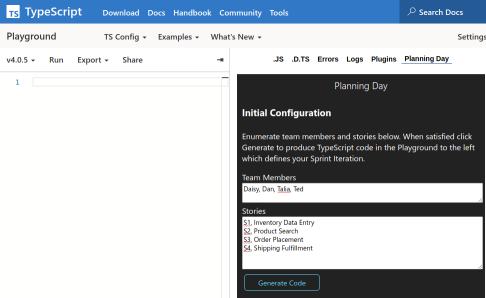

# Overview

TypeScript Language Playground Plug-In to support planning an iteration of work. 

This is an experiment in using the TypeScript type system to complement a standard graphical user interface.

## Configuration
In a GUI provided by the plugin 

- Enumerate all Dev and QA team members.
- Enter all story identifiers
- Click **Generate Code** which will generate TypeScript which defines the iteration.

## Visualization
After generating code the plugin will shift into a Sprint visualization mode 
- Configure the iteration in the Playground's TypeScript code editor by modifying a type-checked JSON object. 
- On the right 
    - Interactive re-ordering of stories through drag/drop.
    - Read-only Gantt chart display of the iteration.
    

